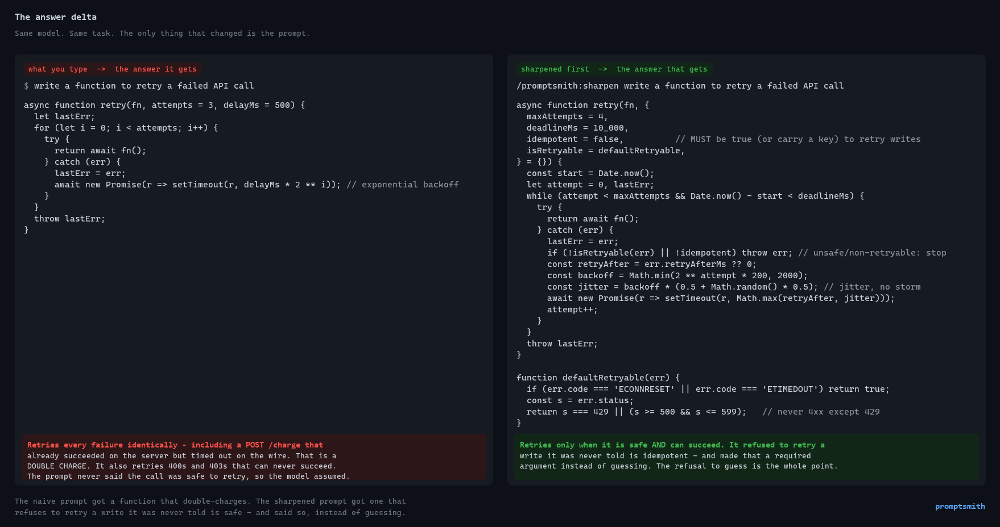

# promptsmith

**Prompt & context engineering for agents — as a Claude Code plugin.**


You already know the move: a rough request gets *far* better results once you've spelled out
the tone you wanted, the constraints you forgot to state, the edge cases you didn't think of,
and asked the agent to push back on you and review the work like a seasoned professional.

`promptsmith` makes that scaffolding a command instead of something you retype every time.

- **No dependencies. No API keys. No model calls.** It's pure method + structure. Your agent
  (Claude Code, or anything you paste the output into) does the reasoning. Model-agnostic by
  construction.
- **Four commands** (three core + a coordinator), one shared engine, a library of expert lenses
  you can extend, and a 20-agent specialist gallery.

---

## What you actually get

Give `/sharpen` a one-line request and it hands back the prompt a senior engineer would have
written for you — every requirement, guardrail, and prohibition the one-liner left unstated, made
explicit. Same request in; the scaffolding *named* on the way out:


Every margin note is a decision a rushed one-liner forgets: which failures are safe to retry, the
jitter that avoids a thundering herd, the prohibition that stops a double charge. The last line is
the honesty floor — it flags the one fact it *can't* know (*is this call idempotent?*) instead of
guessing it. You already know how to write the good version; the point of the tool is that you
don't have to remember to, every time.

<details>
<summary><b>Prefer to see the code it buys you?</b> (the same task, answer-vs-answer)</summary>

<br>

The naive request gets a competent, backoff-aware retry function that **silently retries a
`POST /charge` which already succeeded but timed out on the wire — a double charge.** The sharpened
prompt gets one that retries only what's safe and *refuses to retry a write it was never told is
idempotent*:



</details>

The full four-beat walk-through is in [`docs/assets/proof-answer-delta.md`](docs/assets/proof-answer-delta.md).

---

## What it does

| Command | You give it | You get back |
|---|---|---|
| `/sharpen` | a rough task request | a complete, gap-filled, reviewed **prompt** to paste into any agent |
| `/forge-agent` | a short description of an assistant | a complete, reusable **system prompt** |
| `/lens` | an existing prompt / page / draft | **findings** from expert lenses — or, with `--grade`, a **scored verdict** on a prompt |
| `/orchestrate` | a multi-domain request | **one synthesized deliverable** — the gallery, coordinated *(Layer 2)* |

The first three run with zero model calls, paste-anywhere. `/orchestrate` needs a host that can
spawn subagents (Claude Code) — why that split exists is below, after a real run of each.

Every run is **hybrid**: it returns a finished draft immediately, lists the assumptions it
had to make, and offers a `--deep` interview to resolve them one question at a time.

---

## Example — a real run

**Layer 1 — sharpen a vague ask:**
```
/promptsmith:sharpen make the settings page feel calmer and more trustworthy
```
→ a copy-pasteable prompt with the tone adjectives *named* (calm, ordered, trustworthy), the
accessibility/UX/visual lenses folded into the requirements, guardrails from a red-team pass, and
— because it never invents facts — the stack flagged as `[stack?]` rather than assumed. Below it:
the assumptions it made, the push-back worth hearing, and the open questions.

**Layer 2 — escalate only when the work spans domains.** One command isn't enough when a request
needs a schema *and* an API *and* a security pass *and* tests to agree with each other. That's the
signal to reach for the coordinator — not a first move, an escalation:
```
/promptsmith:orchestrate add public read-only shareable links to user dashboards
```
What happens (the proven flow — from a live run of 7 specialists plus 1 independent verifier,
8 agents in total, logged in `evals/runs/`):
1. **Sharpens** the request, then **decomposes** it into slices: spec · schema · security · API · UI · tests · docs.
2. **Routes** each slice to a gallery agent; **gates** for approval (7 agents > the smart threshold).
3. **Dispatches** them as live subagents in parallel.
4. **Owns the seams** — data-modeler *stores* `expires_at`; the coordinator assigns its *enforcement*
   (the read-time check everyone assumed someone else owned) to the API slice; data-modeler and
   security independently converge on hashing the token, so it stores `sha256(token)`.
5. **Resolves conflicts** — caught a **three-way disagreement on link expiry** (spec "no expiry in
   MVP" vs. schema "optional" vs. security "mandatory") and settled it (mandatory default TTL);
   **escalated** the TTL value and the live-vs-snapshot product call to you instead of guessing.
6. **Verifies, then refuses to ship a hole** — an independent `verifier` re-attacks the built API and
   catches a **HIGH data-exposure defect** the builder's own "allow-list DTO" missed (it allow-listed
   columns but shipped the whole `widgets` blob to anonymous viewers). The pipeline **halts and
   escalates** rather than synthesizing a vouched-for-but-unverified build.
7. **Synthesizes one build plan** — spec, schema, the API handler, the React modal, the test suite,
   and the docs — not seven pasted outputs, with the blocking fix surfaced as an open decision.

---

## Why it matters

The value a skilled person adds to a prompt is invisible scaffolding — the tone they wanted, the
constraints they forgot to state, the edge cases they didn't think of, the push-back they need to
hear. promptsmith makes that scaffolding explicit, repeatable, and auditable — the two runs above
are what that looks like end to end, not a claim to take on faith.

The two-layer split is deliberate. Layer 1 (`/sharpen`, `/forge-agent`, `/lens`) stays portable:
no API keys, no model calls, works pasted into anything. Layer 2 (`/orchestrate`) coordinates the
specialist gallery on multi-domain work, catching the cross-slice conflicts no single agent sees
and escalating real product decisions instead of guessing. Honesty guardrails run through both —
it never fabricates a fact, a citation, or an MCP server it can't verify, and it shows its work
with evals, logged in `evals/runs/`.

---

## Install

### Option A — as a plugin (recommended)

```
/plugin marketplace add emtcmca/promptsmith
/plugin install promptsmith
```

(For local development against a clone, add the working copy instead:
`/plugin marketplace add C:\Dev\promptsmith`.)

Verify, in order:

1. Type `/promptsmith` and confirm all four autocomplete — `/promptsmith:sharpen`,
   `/promptsmith:forge-agent`, `/promptsmith:lens`, `/promptsmith:orchestrate`.
2. Run `/promptsmith:lens --lens skeptic` on any short paragraph. If it reports running the
   `skeptic` lens, the bundled lens library resolved correctly — that is the check that
   actually proves the install, not the autocomplete.

### Option B — manual (standalone, bare command names)

Copy four things into your `~/.claude/` directory (Windows: `C:\Users\<you>\.claude\`):

| Copy this | To here | Needed for |
|---|---|---|
| `commands/` | `~/.claude/commands/` | the four commands |
| `skills/` | `~/.claude/skills/` | the engine + coordinator |
| `lenses/` | `~/.claude/promptsmith-lenses/` | the lens pass |
| `templates/` | `~/.claude/promptsmith-templates/` | `/sharpen`, `/forge-agent`, `/lens --grade` output |
| `agents/` | `~/.claude/promptsmith-agents/` | gallery seeding + `/orchestrate` routing |

Installed this way the commands are bare — `/sharpen`, `/forge-agent`, `/lens`, `/orchestrate` —
because standalone commands aren't namespaced.

Skip any row and that capability degrades: no `lenses/` and the lens step has nothing to load;
no `templates/` and the synthesis step has no skeleton; no `agents/` and `/forge-agent` can't
seed from the gallery while `/orchestrate` has no roster to route to.

### Uninstall

If you installed as a plugin (Option A):

```
/plugin uninstall promptsmith
/plugin marketplace remove emtcmca/promptsmith
```

If you installed manually (Option B), delete what you copied:

- `~/.claude/commands/sharpen.md`, `forge-agent.md`, `lens.md`, `orchestrate.md`
- `~/.claude/skills/prompt-engineering/` and `~/.claude/skills/orchestration/`
- `~/.claude/promptsmith-lenses/`, `~/.claude/promptsmith-templates/`,
  `~/.claude/promptsmith-agents/`

That's the full footprint. promptsmith writes exactly one file on its own, and only after asking:
`~/.claude/promptsmith-coverage-gaps.md`, the log `/orchestrate` appends to when a request slice
falls outside every agent's purview. Delete it too if you created one. Nothing else is written
and no state is left behind.

---

## Usage

> **Command names are namespaced.** Installed as a plugin (Option A), the commands are
> `/promptsmith:sharpen`, `/promptsmith:forge-agent`, `/promptsmith:lens`, and
> `/promptsmith:orchestrate` — type
> `/promptsmith` to autocomplete them. Claude Code namespaces every plugin command to avoid
> collisions; bare `/sharpen` exists only with the manual/standalone install (Option B).
> The examples below use the namespaced form.

### Sharpen a request

```
/promptsmith:sharpen update the dashboard to feel calmer and more authoritative
```

You get a copy-pasteable prompt block (role, objective, requirements with the *named* tone
adjectives, guardrails from a red-team pass, success criteria, output format, out-of-scope),
then the assumptions it made, the push-back worth hearing, and open questions.

Force specific lenses:

```
/promptsmith:sharpen redesign the signup form --lens ux-designer,accessibility
```

Go deep (interview instead of assume):

```
/promptsmith:sharpen draft a violation notice for an unresolved fence dispute --deep
```

### Forge a reusable agent

```
/promptsmith:forge-agent a reviewer that critiques HOA letters for tone and compliance
```

Returns a full system prompt — role, objective, standing operating principles (with the
relevant lens baked in), method including a self-challenge step, guardrails, and an output
contract — ready to drop into a subagent, a skill, or any system-prompt field.

### Review through a lens

```
/promptsmith:lens (paste a component, prompt, or draft) --lens visual-design,accessibility
```

Returns findings (✅ checked / ⚠️ weak / ❌ failing) per lens, worst-first, plus the top 3
fixes by impact. Add `--fix` to get a corrected version in the same run:

```
/promptsmith:lens (paste a component, prompt, or draft) --lens accessibility --fix
```

### Grade a prompt — `/lens --grade`

```
/promptsmith:lens (paste a system prompt) --grade
```

Returns a **scored verdict** — PASS / WEAK / FAIL — with the nine concerns a complete prompt
resolves marked ✅/⚠️/❌, an adversarial quality pass, and the 2–3 fixes that raise the score most.
It grades *coverage, not conformance*: a prompt that resolves a concern in one fluent sentence
passes, and is never docked for failing to look like promptsmith output.

Then compare versions and catch what you broke:

```
/promptsmith:lens (paste the revision) --grade --against (paste the original)
```

Per-dimension deltas, with **regressions called out even when the revision wins overall** — the
thing a one-shot rewrite hides, and the reason to measure instead of eyeballing.

Plain `/lens` gives you findings; `--grade` gives you a measurement, which is what makes two
versions comparable. Same command, one flag — this is the score → change → re-score →
keep-only-what-didn't-regress loop promptsmith runs on itself in `evals/`, pointed at your prompts.

---

## Expert lenses

A lens is a professional's checklist in a markdown file. The 12 built-in lenses:

| Lens | Applies to |
|---|---|
| `ux-designer` | UI, flows, components, forms, navigation |
| `visual-design` | theme, look & feel, typography, color, spacing |
| `accessibility` | a11y, WCAG, keyboard, contrast, screen readers |
| `security-reviewer` | code, auth, data, input, integrations |
| `performance` | speed, scale, queries, rendering, payloads |
| `api-design` | endpoints, contracts, backend routes, integrations, webhooks |
| `data-integrity` | billing, payments, transactions, schemas, migrations, money |
| `seo` | search, metadata, crawlability, structured data, marketing pages |
| `product-strategist` | scope, value, MVP, prioritization |
| `editorial` | copy, email, docs, tone of voice |
| `ai-tells` | removing AI-sounding patterns — tiered vocabulary, rhythm, placeholders |
| `skeptic` | the "push back on me" red-team lens (applied by default) |

### Add your own lens (no fork needed)

Drop a markdown file into either of these — they're loaded automatically and override
built-ins of the same name:

- `~/.claude/promptsmith-lenses/` — available everywhere
- `./.promptsmith-lenses/` — specific to one project

Format:

```markdown
---
name: my-lens
applies-to: comma, separated, topics, that, auto-select, this, lens
---

# My Lens
- A specific check the agent runs the draft against.
- Another check. Keep them concrete and answerable.
```

Then: `/promptsmith:sharpen ... --lens my-lens` (or let auto-select pick it up by topic).

---

## Pre-forged agent gallery

The common `/sharpen` *out-of-scope* items (new features, copywriting, performance,
backend/API, SEO) are exactly the jobs a single task agent should refuse but a user often
needs next. The `agents/` gallery holds ready-to-paste **specialist system prompts** for
them — the kind `/promptsmith:forge-agent` produces, saved so you don't rebuild them cold.

A roster of 20 specialists across spec → plan → build → test → review → document:

- **Build:** `feature-spec`, `planner`, `data-modeler`, `backend-builder`, `frontend-builder`, `test-author`, `refactor-planner`
- **Review:** `api-reviewer`, `security-review`, `verifier`, `evaluator`, `compliance-reviewer`, `debugger`
- **Write:** `copy-rewrite`, `docs-writer`, `sop-writer`, `governance-letter`
- **Meta:** `research-synthesizer`, `prompt-engineer`, `mcp-integrator`

Each carries a named **voice** so it speaks in character at injection. `/promptsmith:forge-agent`
checks this gallery first and **adapts** a close match instead of starting cold. Forge your
own, then drop it in `agents/` to grow the roster. Full list + format in
[`docs/agent-gallery.md`](docs/agent-gallery.md).

> The gallery is also the dispatch roster for the **orchestration layer** (`/orchestrate`,
> shipped — see the live run above): promptsmith as a coordinator that sharpens a prompt,
> dispatches the right specialists, and assembles their work. That layer is Claude-Code-native;
> the core three commands stay zero-call and paste-anywhere. See [`ROADMAP.md`](ROADMAP.md).

## How it works (the engine)

All four commands run one method, defined in
[`skills/prompt-engineering/SKILL.md`](skills/prompt-engineering/SKILL.md):

1. **Route** — sharpen / forge / lens.
2. **Extract** — goal, audience, tone/feel/theme, constraints, success criteria, format, scope.
3. **Gap-fill** — make explicit, labeled, reversible assumptions (so the draft is usable now).
4. **Push-back** — red-team the request; turn weaknesses into guardrails.
5. **Lens pass** — run the draft against the selected professional checklists.
6. **Synthesize** — emit via the matching template.
7. **Surface + offer depth** — list assumptions and open questions; offer the `--deep` interview.

There is no LLM call inside the plugin. The host agent reads the skill and performs the
reasoning. That's what makes it model-agnostic and zero-cost.

---

## Repo layout

```
promptsmith/
  .claude-plugin/      plugin.json + marketplace.json (install metadata)
  commands/            /sharpen, /forge-agent, /lens, /orchestrate
  skills/
    prompt-engineering/SKILL.md   Layer 1 engine (sharpen / forge / lens)
    orchestration/SKILL.md        Layer 2 coordinator (orchestrate)
  lenses/              12 built-in expert lenses
  agents/              the 20-agent gallery / dispatch roster — agent files only
  templates/           output skeletons for sharpen + forge
  evals/               host-judged eval harness (rubric, runner, cases, runs)
  docs/                guides, agent-gallery.md (roster index), coverage-gaps.md,
                       test-run records, README assets
```

---

## Docs

- [USING-PROMPTSMITH.md](docs/USING-PROMPTSMITH.md) — the full how-to (human or agent): install,
  command chooser, every command, lenses, the gallery, orchestration, the eval harness.
- [COMMAND-SHEET.md](docs/COMMAND-SHEET.md) — one-page reference: commands, flags, lenses, gallery,
  recipes.
- [SECURITY.md](docs/SECURITY.md) — threat model + the guardrails (untrusted-input boundary, intent
  gate, supplied-fact verification, independent verification).
- [ROADMAP.md](ROADMAP.md) — the two-layer architecture and what's next.

---

## License

Apache-2.0 © 2026 Eric Tetzlaff
